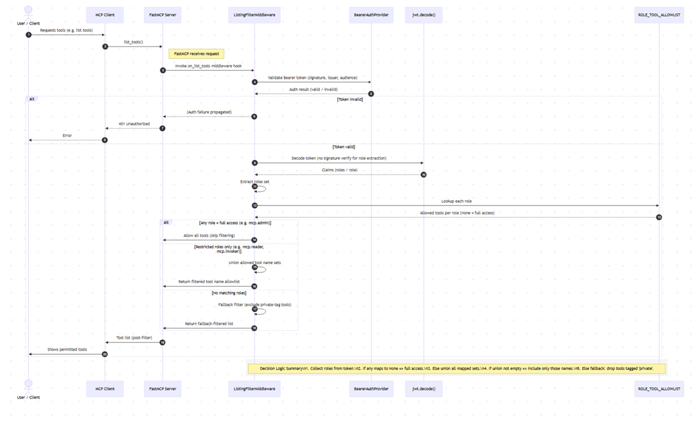

# MCP: FastMCP + Azure Entra ID (App-to-App)

Secure example showing a FastMCP server and client using Azure Entra ID (formerly
Azure AD) for app-to-app authentication. The client obtains a JWT access token from
Azure and calls the protected MCP server; the server validates the token and enforces
role-based access to exposed tools.

Table of Contents
- Features
- Requirements
- Azure Entra ID setup
- Configuration
- Run locally
- Docker
- Contributing
- License

Features
- Example FastMCP server protected by Azure Entra ID (JWT bearer tokens).
- Client demonstrating app-to-app token acquisition and authenticated calls.
- Role-based access control using Azure App Roles.

Requirements
- Python 3.9+ (recommended)
- pip
- Azure subscription to create App Registrations

Azure Entra ID setup (high level)
1. Create a Server (API) App Registration
	 - Register an application for the MCP server.
	 - In "Expose an API" set an Application ID URI (e.g. api://<server-client-id>).
	 - Define **App roles** (e.g. mcp.admin, mcp.invoker, mcp.reader) and grant admin consent.
	 - Note the **Application (client) ID** and **Directory (tenant) ID**.

2. Create a Client App Registration
	 - Register a separate application for the client.
	 - In Authentication enable "Allow public client flows" if using interactive flows,
		 or configure a client secret/certificate for confidential clients.
	 - Under API permissions add your Server/API and grant the appropriate app role (e.g. mcp.invoker).
	 - Grant admin consent and note the **Application (client) ID** and client secret (if applicable).

Configuration
The repository stores example constants in the source for quick testing. For production,
use environment variables instead.

- Server (file): mcp_server/server.py
	- TENANT_ID: Azure Directory (tenant) ID
	- CLIENT_ID: Server App (application) ID

- Client (file): mcp_client/mcp_client.py
	- TENANT_ID: Azure Directory (tenant) ID
	- CLIENT_ID: Client App (application) ID
	- CLIENT_SECRET: (if using a confidential client)
	- API_SCOPE: The Application ID URI for the server (e.g. api://<server-client-id>/.default)

Run locally (quick start)
1. Create and activate a virtual environment:

	 python -m venv .venv
	 .venv\Scripts\Activate.ps1   # Windows PowerShell

2. Install dependencies for server and client:

	 pip install -r mcp_server/requirements.txt
	 pip install -r mcp_client/requirements.txt

3. Update configuration values in the two files or set environment variables.

4. Start the server:

	 python mcp_server/server.py

5. Run the client (example):

	 python mcp_client/mcp_client.py

Docker
- A Dockerfile is provided for both `mcp_server` and `mcp_client` directories. Build
	and run containers after setting required environment variables or mounting a
	configuration file.

Contributing
- Improvements, bug fixes, and documentation updates are welcome. Open an issue or
	submit a pull request with a clear description of changes.

License
- This repository does not include a license file. Add a LICENSE if you intend to
	make the code public under a specific license.

Contact / Notes
- This project is an example. Before running in production, replace inline
	constants with secure environment configuration and follow Azure security best practices.

Files of interest
- mcp_server/server.py — FastMCP server and JWT validation
- mcp_client/mcp_client.py — Client token acquisition and calls

 

